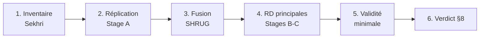

# Water Trap RA — Feuille de route Phase 0

Sep 18, 2026 · @valentine

## Statut

**Pivot du 23/09/2026.** Visio avec Jack : la profondeur comme instrument n'était qu'une suggestion pour l'exercice d'exploration, pas une obligation. On abandonne Sekhri (Jack ne souhaite pas lui écrire) : les voies A et A′ sont closes et le RD à 8 m n'est plus le design de référence. On est en phase d'exploration, avec **trois pistes menées en parallèle** — eau souterraine, groupes électrogènes, filtres domestiques — sans en présélectionner une. Ce qui reste acquis du travail fait : le dépôt, l'environnement R, les outils spatiaux et les variables d'eau SHRUG 1991/2001/2011.

- **Question du projet :** l'eau privée bon marché empêche-t-elle l'émergence du réseau public d'eau courante (piège), ou est-ce une allocation efficace des technologies ?
- **Identification (ouverte) :** plus de design imposé. Pour chaque piste, on cherche une variation exogène du **coût du substitut privé** — et non de la demande de service : géologie, prix du capital, date d'arrivée d'une technologie.
- **Prochaine étape :** trouver la **variable de gauche** (mesure de la provision publique dans le temps) pour les pistes B et C — c'est le verrou, pas les données d'adoption. Puis note de cadrage à Jack.
- **Langage :** R
- **Règle d'or :** critère de sortie écrit avant d'estimer, verdict écrit contre ce critère, aucune variante discutée avant le verdict. (Remplace la règle §5/§8 de la spec, retirée le 23/09 avec le design RD.)

## Trois pistes exploratoires (depuis le 23/09)

**Cadre commun — les cinq conditions du piège.** La question est celle qu'on posait avec Sekhri, élargie : le seuil des 8 m n'était qu'une façon parmi d'autres de déplacer le coût du substitut privé. Le raisonnement ne change pas ; seul change l'objet qui fait varier ce coût.

1. **Le bien public est un réseau à coûts fixes élevés.** Sinon la sortie des uns ne renchérit pas le service des autres : il y a substitution, pas piège.
2. **Le substitut privé est individuel, excluable et indivisible.** C'est ce qui trie par revenu : les ménages solvables sortent, les autres restent.
3. **La variation identifiante porte sur le coût du privé, jamais sur la qualité du public.** Sinon on retombe sur la dépense défensive, où l'anticipation de la qualité publique explique l'adoption — causalité inverse.
4. **L'issue mesurée est la provision publique, pas l'adoption privée.** C'est là que s'arrêtent Brehm, Johnston et Milton (JAERE 2024), qui calibrent la réponse publique au lieu de l'estimer. C'est notre apport.
5. **Un canal explicite relie la sortie privée à la décision publique :** voix politique, assiette fiscale, coût par abonné restant.

Deux distinctions à tenir. **Positif contre normatif :** que le public se retire est une question empirique ; que ce soit un *piège* suppose l'absence d'un régulateur qui redistribue l'économie réalisée — aux États-Unis le retrait est efficient et les non-adoptants y gagnent en facture. **La persistance est le cœur, pas un corollaire :** un retrait temporaire n'est pas un piège ; ce qui ferait le papier, c'est qu'un avantage initial du privé laisse vingt ans plus tard un territoire durablement moins équipé, alors que la somme des équipements individuels dépasse le coût du réseau jamais construit.

**Critère de tri entre pistes :** gagne celle où les cinq conditions tiennent **et** où la variable de gauche existe.

| Piste | Substitut privé | Variation identifiante | Statut |
| --- | --- | --- | --- |
| A — Eau souterraine | Forage et pompe | Géologie (roche, fractures, aquifère), à la Ryan & Sudarshan | Close le 23/09 — premier stage non concluant |
| B — Électricité | Groupe électrogène | Prix du capital (importations, droits de douane), TVA diesel par État, normes CPCB en NCR | À cadrer, littérature à lire |
| C — Eau potable | Filtre domestique | Arrivée du marché de masse : Pureit national début 2008, Tata Swach déc. 2009 | La plus prometteuse côté données |

### Piste A — La géologie comme instrument

Ryan & Sudarshan (JPE 2022) instrumentent la profondeur du puits du paysan par le type de roche (62 catégories), le type d'aquifère (20), la densité de fractures et leurs interactions, en contrôlant élévation, pente et qualité des sols ; l'exclusion est l'absence d'effet direct sur les profits. Avantage pour nous : plus besoin de la profondeur observée village par village, donc plus besoin des microdonnées MI. Limite : la géologie est invariante dans le temps, et à l'échelle de l'Inde « alluvial vs socle » sépare aussi le revenu, la densité et la capacité administrative.

**Verdict du 23/09 : la piste A échoue.** Sur l'Andhra Pradesh non divisé, puits avec relevé de mai avant 2000, 84,9 % de la variance de profondeur est intra-district — donc il y avait de quoi expliquer — mais le bloc géologie apporte un gain de R² hors échantillon de −0,006 en validation croisée par blocs de districts, contre un seuil de passage fixé d'avance à 0,05. Le F partiel de 12,3 ne tenait qu'à deux classes marginales. Second constat, plus général : au sein des districts, les classes du socle hors granite recoupent l'économie locale de 1991 (villages plus petits, 8 à 19 km plus loin d'une ville, part ST plus élevée, moins alphabétisés ; tests joints p < 0,03 sur 4 caractéristiques sur 5), donc la géologie atteint la provision publique par des canaux étrangers au coût de l'eau. La restriction d'exclusion aurait échoué même avec un premier stage solide — et cela vaut au-delà de l'AP et de la carte au 1:2M. Mémo : `memo/piste_a_premier_stage_verdict.md`.

- [ ] Récupérer les couches publiques : aquifères principaux CGWB, lithologie GSI/Bhukosh ; GLiM et WHYMAP en secours
- [ ] Premier stage sur les puits CGWB déjà téléchargés : profondeur \~ roche + fractures + contrôles de surface
- [ ] Trancher IV en niveau (fragile hors d'une petite région) vs DiD géologie × choc temporel (électrification rurale, diffusion des pompes submersibles), avec effets fixes shrid
- [ ] Lire Blakeslee, Dar, Fishman, Malik, Pellegrina & Sekhri (JDE) et Blakeslee et al., « Way down in the hole »

### Piste B — Groupes électrogènes

Le prix du diesel est l'idée naturelle et l'impasse : il entre dans le transport, l'irrigation et la production, donc la forme réduite ne mesure rien d'interprétable. Trois contournements, du plus au moins propre.

- [ ] **Prix du capital plutôt que du carburant** (piste préférée) : baisse des prix des gensets importés, droits de douane ; shift-share sur l'exposition de base
- [ ] TVA diesel par État × exposition de base aux coupures (mesures ASI d'Allcott, Collard-Wexler & O'Connell, AER 2016)
- [ ] Choc réglementaire local : restrictions CPCB sur les groupes diesel en NCR (interdictions saisonnières, retrofit RECD)
- [ ] Données : ASI (auto-production captive, dépenses de carburant), Economic Census, NSS/IHDS côté ménages
- [ ] Garder le sens en tête : la littérature existante va des coupures vers l'adoption ; nous voulons le retour

### Piste C — Filtres à eau domestiques

Le timing du marché de masse tombe très bien : Pureit introduit en 2005 à Chennai puis dans le Sud, lancement national début 2008 ; Tata Swach lancé le 7 décembre 2009 à moins de 1 000 ₹, sans électricité ni eau courante. La bascule tombe donc entre les recensements 2001 et 2011, entre NFHS-3 (2005-06) et NFHS-4 (2015-16), et entre IHDS-I (2004-05) et IHDS-II (2011-12, qui est un panel de ménages).

**Repérage des données, 25/09.** *Variable de gauche.* Pas de panel de finances municipales avant 2015 : cityfinance.in couvre 2015-16 à 2021-22 pour environ 3 300 collectivités sur 4 700, et le rapport RBI est transversal sur 35 corporations. La version « dépenses » est donc impossible en Inde urbaine — abandonnée. En revanche le NSS Schedule 1.2 porte les deux côtés de l'équation : source principale d'eau de boisson (19 codes, dont piped into dwelling / to yard / from neighbour / public tap), suffisance toute l'année et mois de pénurie, distance, et surtout **l'accès codant si la source a été créée sur fonds publics ou privés** (codes 4-5 vs 6-7). Série Schedule 1.2 : 28e (1973-74), 44e (1988-89), 49e (janv-juin 1993), 58e (juil-déc 2002), 65e (juil 2008-juin 2009), 69e (juil-déc 2012), 76e (juil-déc 2018). Codes de district et de région NSS dans le bloc d'identification.

*Le problème.* Le 58e round (2002) est une enquête « Housing Condition » : source et suffisance présentes (`B4_q1`, `B4_q2`), mais **pas de méthode de traitement de l'eau** — l'item n'apparaît qu'avec l'élargissement « Drinking Water, Sanitation, Hygiene ». Autrement dit la variable de gauche a une série longue, la variable de droite peut-être seulement à partir du 65e, c'est-à-dire pendant le choc. À vérifier : le 54e round (janv-juin 1998) a collecté eau, assainissement et hygiène mais via le **Schedule 31**, pas 1.2 — comparabilité inter-schedule à établir. Si l'item manque avant 2008, l'ancrage pré-choc doit venir d'IHDS-I (2004-05), qui cite Aquaguard et le filtre acheté dans le libellé.

*Deux ruptures de série à retenir.* La qualité de l'eau de la source principale, collectée au 69e, n'est **pas** reprise au 76e. Et la méthode de traitement est à réponse unique : si plusieurs s'appliquent, c'est le premier code de la liste qui est enregistré — le purificateur électrique étant le code 1, il domine (pratique pour nous), mais un ménage qui bout *et* filtre est compté comme filtrant. Enfin le 76e ajoute les bénéfices reçus des programmes publics (NRDWP, AMRUT), utile mais postérieur à 2015.

- [ ] **Priorité :** vérifier si le 54e round (Schedule 31, 1998) contient un item de traitement de l'eau, et si le 65e est le premier de la série 1.2 à l'avoir. C'est ce qui décide si la piste C a un avant
- [ ] Ancrage pré-choc de secours : IHDS-I (2004-05), item traitement (bouillir / filtre acheté / Aquaguard / produits chimiques), panel avec IHDS-II (2011-12)
- [ ] Construire la variable de gauche depuis le NSS : source principale publique vs privée, accès sur fonds public (codes 4-5) vs privé (6-7), suffisance, distance
- [ ] Harmoniser les districts entre rounds, ou travailler à la maille des régions NSS, plus stables
- [ ] Traiter le 65e round (juil 2008-juin 2009) comme période de transition, pas comme « après »
- [ ] Compléments : recensements 2001/2011 pour la part d'eau traitée (`tap_treated11` déjà construit) ; budgets des États (publication annuelle RBI) pour une série longue mais grossière
- [ ] Vérifier item par item les libellés avant toute comparaison inter-rounds

### À trancher avec Jack

- [ ] Un seul cas approfondi, ou trois chapitres d'un même papier sur la même mécanique ?
- [ ] Périmètre géographique par piste
- [ ] Ce qu'on garde du travail SHRUG déjà fait (variables d'eau, ancre des manquants 2001/2011)

## À faire maintenant

Mise en place terminée. Voies A et A′ (microdonnées de Sekhri) abandonnées le 23/09. La section Voie B ci-dessous est conservée : ses outils spatiaux et les puits CGWB resservent directement à la piste A.

**Documents**

- [x] Décompresser `phase0_packet.zip` et lire FAST\_PATH.md et KICKOFF.md
- [x] Mettre à jour CLAUDE.md pour R (section Tooling, `make all` → `Rscript run_all.R`, matplotlib → ggplot2), puis répercuter dans RA\_INSTRUCTIONS §A5 et KICKOFF pour que le packet reste cohérent

**Comptes et téléchargements**

- [x] Télécharger Sekhri 2011 (openICPSR 113803 ; code et Readme seulement, aucune donnée)
- [x] Créer un compte openICPSR et télécharger Sekhri 2014 (projet 113902)
- [x] Télécharger les modules SHRUG v2.2 (clés, PCA et VD 1991/2001/2011)
- [x] Tout ranger dans `raw/sekhri/` et `raw/shrug/` sans rien modifier

**Environnement**

- [x] Créer le dépôt `water-trap` (hors OneDrive), `git init`, commit du packet
- [x] Initialiser `renv` ; installer haven, dplyr, readr, rdrobust, rddensity, ggplot2
- [ ] Vérifier que `rdd` s'installe encore (bande IK pour la réplication)
- [x] Installer VS Code + extension Claude Code ; faire confiance au workspace

**Inventaire à la main**

- [x] Lancer le script d'inspection sur chaque `.dta` de Sekhri
- [x] Noter : variable de profondeur et millésime, unité, identifiants (codes village 2001 ? coordonnées ? district seulement ?)
- [x] Envoyer le mail au PI avec l'inventaire et les questions ouvertes

## Voie B — préparation (E1, profondeur indépendante)

À préparer en attendant Jack : collecte de données et outillage seulement, aucune estimation. Les principes sont fixés par la spec (§3.2, §4) : puits d'observation CGWB, relevé le plus ancien et pré-mousson (mai), interpolation jusqu'aux villages avec une erreur par village, puis RD flou ou sous-échantillon proche d'un puits.

**Données et outils**

- [ ] Données de puits CGWB (India-WRIS) : coordonnées et niveaux trimestriels ; vérifier le plus ancien relevé par puits (cible : milieu des années 1990)
- [ ] Explorer les raccourcis : couche des stations India-WRIS ; fichier national 1996–2017 que d'autres chercheurs ont obtenu du CGWB par mail
- [ ] SHRUG : module « Open Polygons and Spatial Statistics » dans `raw/shrug/`, avec sa ligne dans le README
- [ ] Packages R : sf, terra, exactextractr, gstat, puis `renv::snapshot()`

**Faisabilité (sans toucher aux résultats)**

- [ ] Densité de puits par district ; part des villages à moins de quelques kilomètres d'un puits

**Choix à faire trancher par Jack**

- [ ] Périmètre : Uttar Pradesh seul, plaine gangétique ou Inde entière
- [ ] Méthode d'interpolation (krigeage ou IDW) et rayon du sous-échantillon proche des puits

## Plan Phase 0a

**Suspendu depuis le 23/09** — ce plan dépendait des microdonnées Sekhri. Conservé comme gabarit : les six étapes, leurs critères de sortie et la discipline d'analyse restent valables pour la piste qui sera retenue.



### 1. Inventaire Sekhri (½ jour)

- [x] Mémo d'une page par package : profondeur et millésime, unité, bande, noyau, définitions, clés de fusion
- [ ] Signaler tout résultat de Sekhri 2011 qui devancerait une de nos contributions
- [x] **Sortie :** clés village présentes → continuer ; district seulement → E1 ou escalade au PI. **Résultat (18/09) :** ni profondeur ni clés dans les deux packages → escalade faite.

### 2. Réplication de Sekhri 2014 — Stage A (½ à 1 jour)

- [ ] Reproduire avec son estimateur : `rd` de Stata (noyau rectangulaire, bande IK) et bande de 5 ; score = profondeur **1993** (2ᵉ recensement MI) − 8 ; villages qui franchissent 8 m entre 1993 et 2000 exclus. Bloqué tant que les fichiers MI ne sont pas obtenus.
- [ ] Cible : 0,097 (0,04) sur le taux de pauvreté, Table 6 col. 3
- [ ] Ré-estimer ensuite en CCT (triangulaire, MSE-optimale)
- [ ] **Sortie :** chiffres reproduits et signe de `z` confirmé ; sinon STOP

### 3. Fusion des variables d'eau SHRUG (1 jour)

- [ ] Vérifier les noms des variables d'eau 2001/2011 sur docs.devdatalab.org et les noter dans l'en-tête du script
- [ ] Rattacher `tap11`, `tap_treated11`, `private_gw11` aux villages de Sekhri via `shrid2` (en caractères)
- [ ] Log du taux d'appariement ; enquêter si < 80 %
- [ ] **Sortie :** taux d'appariement documenté et acceptable

### 4. RD principales — Stages B et C (1 jour)

- [ ] Première étape : `private_gw` saute vers le bas à `z > 0`
- [ ] Résultat principal : `tap` / `tap_treated` sautent vers le haut à `z > 0`
- [ ] Placebo : `drnk_wat_f` ne saute pas
- [ ] Chaque régression sous les deux traitements des valeurs manquantes (missing = 0 et listwise)
- [ ] Donut RD pour l'empilement aux profondeurs entières (0,5 m ; robustesse 0,25 et 1,0)

### 5. Validité minimale (1 jour)

- [ ] Test de densité McCrary / Cattaneo-Jansson-Ma
- [ ] Continuité des covariables pré-traitement disponibles chez Sekhri (jamais le taux d'épuisement ni le nombre de puits)
- [ ] Seuils placebo à 6, 7, 9 et 10 m

### 6. Verdict (½ jour)

- [ ] Mémo `memo/phase0_decision_memo.pdf` : verdict §8 en première ligne, puis magnitudes, puis recommandation
- [ ] Mail au PI en quatre phrases : verdict, magnitudes, validité, recommandation
- [ ] Vérifier que `Rscript run_all.R` reproduit tout depuis un clone propre

## Checkpoints manuels

Dix points où ton jugement remplace celui de l'agent ; ne les coche qu'après avoir vu toi-même l'objet (tableau, graphique, log).

- [ ] **1. Compréhension du cadre** : l'agent restitue la question (quand le privé prend-il le relais du public), la variation identifiante de la piste et le sens attendu de l'effet
- [ ] **2. Source de variation** : ce qui est exploité porte bien sur le **coût du substitut privé**, pas sur la demande de service
- [ ] **3. Pertinence** : l'instrument ou le choc déplace visiblement l'adoption privée ; magnitude du premier stage regardée à l'œil, pas seulement le F
- [ ] **4. Pré-tendances** : pour toute spécification en différences, trajectoires vues sur graphique avant la moindre estimation
- [ ] **5. Clés et taux d'appariement** : la fusion garde bien les unités ; taux documenté, enquête si < 80 %
- [ ] **6. Mécanismes rivaux** : épuisement de la ressource, revenu, capacité administrative — testés, pas seulement invoqués
- [ ] **7. Le privé bouge en premier** : aucun récit où le coût du public saute au même endroit que celui du privé
- [ ] **8. Stabilité aux manquants** : missing = 0 vs listwise comparés, écart signalé
- [ ] **9. Verdict** écrit contre des critères fixés d'avance, avant toute discussion de variantes
- [ ] **10. Reproductibilité** : une commande depuis un clone propre

**Escalade immédiate au PI si :** premier stage ou choc trop faible ; pré-tendances qui divergent ; pas de fusion possible ; résultats qui s'inversent selon la spécification ou le traitement des manquants ; une piste qui bute sur des données non publiques ; tentation de garder une piste qui ne marche pas.

## Questions pour le PI

Points ouverts à regrouper dans un prochain mail, envoyé après l'inventaire, avec les faits trouvés.

**Mise à jour 23/09 :** liste triée après le pivot. Les points liés à la réplication de Sekhri (clés de fusion, estimateur du Stage A, puissance sur 1 171 villages, dispersion de l'habitat, numérotation des extensions) sont retirés — ils sont sans objet.

- [ ] **Mesure de l'adoption privée :** `private_gw` mélange « tubewell OU handpump », donc sans doute les India Mark II publiques, et sature près de 1 dans l'UP. Quelle mesure retenir pour la piste A ?
- [ ] **Périmètre et échelle :** shrid, district ou ville selon la piste ; l'Inde entière est-elle défendable pour un instrument géologique, ou faut-il se restreindre à une région ?
- [ ] **Accès aux données :** ASI pour les générateurs, IHDS et NFHS pour les filtres — a-t-il des accès ou des contacts à mobiliser ?
- [ ] **Langage :** analyse en R plutôt qu'en Python (rdrobust, rddensity, sf, gstat en implémentations de référence) — toujours à confirmer

## Journal des décisions

Une ligne par décision, la plus récente en haut ; noter qui a tranché.

| Date | Décision | Raison | Validée par |
| --- | --- | --- | --- |
| 23/09/2026 | Geler 06 et 07 (interpolation, variogrammes) et les sortir de run\_all.R ; garder leurs résultats comme constats | L'interpolation reconstruisait une profondeur au village pour le RD ; le premier stage de la piste A est au puits. À retenir : bruit de mesure médian 0,73 m (d'où la moyenne de plusieurs relevés de mai), portée du variogramme 30-70 km (point de départ pour des SE de Conley, à ré-estimer sur les résidus) | Valentine |
| 23/09/2026 | Explorer trois pistes en parallèle : eau souterraine (géologie), groupes électrogènes, filtres domestiques | Phase d'exploration assumée : certaines ne marcheront pas, on ne présélectionne pas | Jack et Valentine (visio) |
| 23/09/2026 | Abandon de Sekhri et du RD à 8 m comme design de référence | Jack ne souhaite pas écrire à Sekhri ; la profondeur comme instrument n'était qu'une suggestion pour l'exploration | Jack (visio) |
| 18/09/2026 | Escalade : proposer la voie A (données de Sekhri) et préparer la voie B (E1) en parallèle | Packages 113902 et 113803 sans profondeur ni clés vers le recensement (0 % de match avec SHRUG) | Valentine ; en attente de Jack |
| 18/09/2026 | Analyse en R (renv, rdrobust, rddensity) | Implémentations de référence de l'estimateur RD | Valentine ; à confirmer par le PI |

## Journal des sessions Claude Code

Une ligne par session, avec son commit git, pour pouvoir revenir en arrière. Avant chaque session de construction : modèle le plus capable, Extended Thinking, Plan Mode (Shift+Tab) ; `/compact` entre les phases.

| Date | Session | Objectif | Résultat / ce que j'ai vérifié | Commit |
| --- | --- | --- | --- | --- |
|  | Session 1 | Dépôt, validation des fichiers, inventaire, réplication Stage A |  |  |
|  | Session 2 | Fusion, RD principales, validité minimale, verdict |  |  |

### Premier prompt de la Session 1 (Plan Mode)

Version de KICKOFF adaptée à R et aux deux packages Sekhri :

```
Read CLAUDE.md, PHASE0_SPEC.md, and FAST_PATH.md in full. This project is done in R only (see the Tooling section of CLAUDE.md). Then:
(a) summarize back the design, the sign conventions, the §8 decision gate, and the analysis-discipline constraints in your own words so I can check your understanding;
(b) inventory what is in raw/, i.e. BOTH Sekhri packages (2014, openICPSR 113902, and 2011, 2010-0056_data.zip): for each, the running variable and its vintage, the unit of analysis, the bandwidth and kernel, and the merge keys available to join our SHRUG/Census public-water outcomes. Report what you find; do not guess variable names;
(c) propose the repository scaffold, the renv setup, the ingest-validation plan, and a plan to replicate Sekhri (2014) Table 6 with HER estimator first (rectangular kernel, IK bandwidth, bandwidths 5 and 2) before any CCT re-estimation.
Do not write any analysis code beyond the Stage A replication plan yet, and do not start extensions.
```

## Extensions (seulement si 0a est vert)

Environ 3 à 5 semaines de plus (« Phase 0b »), dans l'ordre de FAST\_PATH, du moins cher au plus cher. Numérotation de FAST\_PATH, reprise par RA\_INSTRUCTIONS, CLAUDE.md et KICKOFF.

| Ordre | Extension | Contenu | Coût | Données |
| --- | --- | --- | --- | --- |
| 1 | E3 — Agriculture (mécanisme) | Répliquer son résultat irrigation / revenu ; « plus riches mais moins d'eau publique » ; jamais en contrôle | Faible | Souvent déjà dans les données Sekhri |
| 2 | E4 — Batterie de validité complète | Balayages bande / polynôme / donut, placebos routes / écoles / dispensaires, sous-échantillon proche des puits | Faible à moyen | Idem |
| 3 | E2 — Take-up JJM + type de schéma | Raccordement quand un schéma gratuit est offert ; timing via Wayback ; test « le piège colle » | Moyen | JJM IMIS + Wayback |
| 4 | E1 — Profondeur indépendante | Interpolation CGWB, 1er relevé pré-mousson, erreur de mesure | Moyen | India-WRIS / CGWB |
| Phase 1 | E5 — Lithologie | Bras §9 et figure géologie × décennie | Élevé | GSI Bhukosh ; numérisation DCHB |
| Phase 1 | E6 — Odisha / Drink-from-Tap | Tests sur l'ancienneté des équipements privés | Élevé | WATCO, partenariat à part |

## Ressources

**Documents du projet** (dossier Drive « research assistant ») : [dossier](https://drive.google.com/drive/folders/1C1xJhsl62NqJWLa06aM1xohioaimIK2d) · RA\_OVERVIEW (le pourquoi) · RA\_INSTRUCTIONS (le comment) · PHASE0\_SPEC (variables, régressions, §8) · CLAUDE.md (règles de l'agent) · FAST\_PATH et KICKOFF · README (ordre de lecture et règle de cohérence du packet).

**Articles**

- Sekhri (2014), « Wells, Water, and Welfare », *AEJ: Applied* 6(3) — [PDF dans le dossier](https://drive.google.com/file/d/1WI4E3f4VQWbgmEns188b9B5BbM71tr-q/view) ; réplication openICPSR 113902 (code, pauvreté et enquête ; pas de profondeur)
- Sekhri (2011), « Public Provision and Protection of Natural Resources », *AEJ: Applied* 3(4) — antécédent le plus proche, à citer en premier ; réplication openICPSR 113803 (code seulement)
- Blakeslee, Fishman et Srinivasan (2020), *AER* — contrepoint : l'échec des puits ne déclenche pas de provision publique
- Blakeslee et Fishman (2018, wp), inégalités et accès à l'eau qui s'épuise — version à retrouver
- Srinivasan et al. (2025), *PLOS Water* — mécanisme rival d'épuisement
- Ryan et Sudarshan (2022), « Rationing the Commons », *JPE* 130(1) — géologie (roche, fractures, aquifère) comme instrument de la profondeur ; modèle de la piste A
- Allcott, Collard-Wexler et O'Connell (2016), *AER* — pénuries d'électricité et auto-production dans l'ASI ; mesures réutilisables pour la piste B
- Blakeslee, Dar, Fishman, Malik, Pellegrina et Sekhri (JDE), et Blakeslee et al., « Way down in the hole » — géologie de socle et assèchement des puits
- Hirschman (1970), *Exit, Voice and Loyalty* — cadre du retrait politique, pistes B et C

**Données :** openICPSR · devdatalab.org (SHRUG) · docs.devdatalab.org/variable-search pour les noms de variables 2001/2011.
