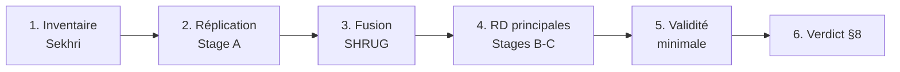

# Water Trap RA — Feuille de route Phase 0

Sep 18, 2026 · @valentine

## Statut

**Pivot du 23/09/2026.** Visio avec Jack : la profondeur comme instrument n'était qu'une suggestion pour l'exercice d'exploration, pas une obligation. On abandonne Sekhri (Jack ne souhaite pas lui écrire) : les voies A et A′ sont closes et le RD à 8 m n'est plus le design de référence. On est en phase d'exploration, avec **trois pistes menées en parallèle** — eau souterraine, groupes électrogènes, filtres domestiques — sans en présélectionner une. Ce qui reste acquis du travail fait : le dépôt, l'environnement R, les outils spatiaux et les variables d'eau SHRUG 1991/2001/2011.

- **Question du projet :** l'eau privée bon marché empêche-t-elle l'émergence du réseau public d'eau courante (piège), ou est-ce une allocation efficace des technologies ?
- **Identification (ouverte) :** plus de design imposé. Pour chaque piste, on cherche une variation exogène du **coût du substitut privé** — et non de la demande de service : géologie, prix du capital, date d'arrivée d'une technologie.
- **Prochaine étape :** piste H, jambe privée. Toutes les pistes indiennes (A à G) sont fermées ; le terrain est désormais le Bangladesh. Branche piste-h-arsenic, critère et seuil à écrire et commiter avant la première lecture d'issue.
- **Langage :** R
- **Règle d'or :** critère de sortie écrit avant d'estimer, verdict écrit contre ce critère, aucune variante discutée avant le verdict. (Remplace la règle §5/§8 de la spec, retirée le 23/09 avec le design RD.)

## Trois pistes exploratoires (depuis le 23/09)

**Cadre commun — les cinq conditions du piège.** La question est celle qu'on posait avec Sekhri, élargie : le seuil des 8 m n'était qu'une façon parmi d'autres de déplacer le coût du substitut privé. Le raisonnement ne change pas ; seul change l'objet qui fait varier ce coût.

1. **Le bien public est un réseau à coûts fixes élevés.** Sinon la sortie des uns ne renchérit pas le service des autres : il y a substitution, pas piège.
2. **Le substitut privé est individuel, excluable et indivisible.** C'est ce qui trie par revenu : les ménages solvables sortent, les autres restent.
3. **La variation identifiante porte sur le coût du privé, jamais sur la qualité du public.** Sinon on retombe sur la dépense défensive, où l'anticipation de la qualité publique explique l'adoption — causalité inverse.
4. **L'issue mesurée est la provision publique, pas l'adoption privée.** C'est là que s'arrêtent Brehm, Johnston et Milton (JAERE 2024), qui calibrent la réponse publique au lieu de l'estimer. C'est notre apport.
5. **Un canal explicite relie la sortie privée à la décision publique :** voix politique, assiette fiscale, coût par abonné restant.

Deux distinctions à tenir. **Positif contre normatif :** que le public se retire est une question empirique ; que ce soit un *piège* suppose l'absence d'un régulateur qui redistribue l'économie réalisée — aux États-Unis le retrait est efficient et les non-adoptants y gagnent en facture. **La persistance est le cœur, pas un corollaire :** un retrait temporaire n'est pas un piège ; ce qui ferait le papier, c'est qu'un avantage initial du privé laisse vingt ans plus tard un territoire durablement moins équipé, alors que la somme des équipements individuels dépasse le coût du réseau jamais construit.

**Critère de tri entre pistes :** gagne celle où les cinq conditions tiennent **et** où la variable de gauche existe.

| Piste | Substitut privé | Variation identifiante | Statut |
| --- | --- | --- | --- |
| A — Eau souterraine | Forage et pompe | Géologie (roche, fractures, aquifère), à la Ryan & Sudarshan | Close le 23/09 — premier stage non concluant |
| B — Électricité | Groupe électrogène | Prix du capital (importations, droits de douane), TVA diesel par État, normes CPCB en NCR | À cadrer, littérature à lire |
| C — Eau potable | Filtre domestique | Arrivée du marché de masse : Pureit national début 2008, Tata Swach déc. 2009 | Close le 27/09 — pas de point pré-choc, et filtre marginal hors Inde |

### Piste A — La géologie comme instrument

Ryan & Sudarshan (JPE 2022) instrumentent la profondeur du puits du paysan par le type de roche (62 catégories), le type d'aquifère (20), la densité de fractures et leurs interactions, en contrôlant élévation, pente et qualité des sols ; l'exclusion est l'absence d'effet direct sur les profits. Avantage pour nous : plus besoin de la profondeur observée village par village, donc plus besoin des microdonnées MI. Limite : la géologie est invariante dans le temps, et à l'échelle de l'Inde « alluvial vs socle » sépare aussi le revenu, la densité et la capacité administrative.

**Verdict du 23/09 : la piste A échoue.** Sur l'Andhra Pradesh non divisé, puits avec relevé de mai avant 2000, 84,9 % de la variance de profondeur est intra-district — donc il y avait de quoi expliquer — mais le bloc géologie apporte un gain de R² hors échantillon de −0,006 en validation croisée par blocs de districts, contre un seuil de passage fixé d'avance à 0,05. Le F partiel de 12,3 ne tenait qu'à deux classes marginales. Second constat, plus général : au sein des districts, les classes du socle hors granite recoupent l'économie locale de 1991 (villages plus petits, 8 à 19 km plus loin d'une ville, part ST plus élevée, moins alphabétisés ; tests joints p < 0,03 sur 4 caractéristiques sur 5), donc la géologie atteint la provision publique par des canaux étrangers au coût de l'eau. La restriction d'exclusion aurait échoué même avec un premier stage solide — et cela vaut au-delà de l'AP et de la carte au 1:2M. Mémo : `memo/piste_a_premier_stage_verdict.md`.

- [x] Récupérer les couches publiques : aquifères principaux CGWB, lithologie GSI/Bhukosh ; GLiM et WHYMAP en secours
- [x] Premier stage sur les puits CGWB déjà téléchargés : profondeur \~ roche + fractures + contrôles de surface
- [x] Trancher IV en niveau vs DiD géologie × choc temporel — tranché par l'échec du premier stage, la question ne se pose plus
- [ ] Lire Blakeslee, Dar, Fishman, Malik, Pellegrina & Sekhri (JDE) et Blakeslee et al., « Way down in the hole »

### Piste B — Groupes électrogènes

Le prix du diesel est l'idée naturelle et l'impasse : il entre dans le transport, l'irrigation et la production, donc la forme réduite ne mesure rien d'interprétable. Trois contournements, du plus au moins propre.

- [ ] **Prix du capital plutôt que du carburant** (piste préférée) : baisse des prix des gensets importés, droits de douane ; shift-share sur l'exposition de base
- [ ] TVA diesel par État × exposition de base aux coupures (mesures ASI d'Allcott, Collard-Wexler & O'Connell, AER 2016)
- [ ] Choc réglementaire local : restrictions CPCB sur les groupes diesel en NCR (interdictions saisonnières, retrofit RECD)
- [ ] Données : ASI (auto-production captive, dépenses de carburant), Economic Census, NSS/IHDS côté ménages
- [ ] Garder le sens en tête : la littérature existante va des coupures vers l'adoption ; nous voulons le retour

### Piste C — Filtres à eau domestiques

Le timing du marché de masse tombe très bien : Pureit introduit en 2005 à Chennai puis dans le Sud, lancement national début 2008 ; Tata Swach lancé le 7 décembre 2009 à moins de 1 000 ₹, sans électricité ni eau courante. La bascule tombe donc entre les recensements 2001 et 2011, entre NFHS-3 (2005-06) et NFHS-4 (2015-16), et entre IHDS-I (2004-05) et IHDS-II (2011-12, qui est un panel de ménages).

**Repérage des données, 25/09.** *Variable de gauche.* Pas de panel de finances municipales avant 2015 : cityfinance.in couvre 2015-16 à 2021-22 pour environ 3 300 collectivités sur 4 700, et le rapport RBI est transversal sur 35 corporations. La version « dépenses » est donc impossible en Inde urbaine — abandonnée. En revanche le NSS Schedule 1.2 porte les deux côtés de l'équation : source principale d'eau de boisson (19 codes, dont piped into dwelling / to yard / from neighbour / public tap), suffisance toute l'année et mois de pénurie, distance, et surtout **l'accès codant si la source a été créée sur fonds publics ou privés** (codes 4-5 vs 6-7). Série Schedule 1.2 : 28e (1973-74), 44e (1988-89), 49e (janv-juin 1993), 58e (juil-déc 2002), 65e (juil 2008-juin 2009), 69e (juil-déc 2012), 76e (juil-déc 2018). Codes de district et de région NSS dans le bloc d'identification.

*Corrigé le 27/09 après inventaire des microdonnées — la piste C n'a pas de point pré-choc.* **Adoption privée :** aucune mesure avant 2012. Le 54e round (1998) n'est pas accessible ; les rounds 58 (2002) et 65 (2008-09) n'ont pas d'item de traitement ; et l'IHDS, contrairement à ce qui était noté ici le 25/09, ne demande que la **fréquence** du traitement de l'eau — bouillir, filtre acheté, Aquaguard et produits chimiques sont regroupés dans une seule question, la méthode n'est jamais enregistrée, aux deux vagues. Entre 2012 et 2018, la comparaison n'est possible qu'en « appareil de purification, tous types » (codes 1 + 5) : le code 1 passe de « electronic purifier » non défini à « electric purifier (RO, UV) », le code 5 de « water filter (candle, ceramic, sand) » à « non-electric purifier », donc un purificateur à gravité type Pureit peut basculer d'un code à l'autre. **Provision publique :** le codage fonds publics / fonds privés de la source (codes 4-7, sources à usage collectif seulement) n'existe qu'aux rounds 69 et 76 — le 58e ne distingue qu'usage exclusif, commun ou collectif. La source principale ne se compare qu'en catégories agrégées, et sa définition change à chaque round : usage majeur (58), le plus fréquent (69), le plus gros volume (76).

*Contraintes géographiques, confirmées sur les fichiers.* Les régions NSS ont été redécoupées entre le 58e et le 69e (78 régions deviennent 88, codes réattribués). Les codes de district ne sont pas comparables non plus : le 69e ajoute des districts aux codes de 2001, le 76e renumérote dans l'ordre du recensement 2011. Toute comparaison inter-rounds exige une table de passage construite sur les noms. *Panel IHDS :* clé reconstituée faute de variables de liaison dans les fichiers ICPSR — `HHID` (IHDS-II) = 10 × `HHID` (IHDS-I) + `HHSPLITID`, qui relie 40 018 ménages et retrouve 83,4 % d'IHDS-I, conforme au guide ; les ménages codés 9 sont des remplacements à ne pas relier. Mémo : `memo/piste_c_inventaire_donnees.md`.

*Deux ruptures de série à retenir.* La qualité de l'eau de la source principale, collectée au 69e, n'est **pas** reprise au 76e. Et la méthode de traitement est à réponse unique : si plusieurs s'appliquent, c'est le premier code de la liste qui est enregistré — le purificateur électrique étant le code 1, il domine (pratique pour nous), mais un ménage qui bout *et* filtre est compté comme filtrant. Enfin le 76e ajoute les bénéfices reçus des programmes publics (NRDWP, AMRUT), utile mais postérieur à 2015.

- [x] **Priorité :** vérifier si le 54e round (Schedule 31, 1998) contient un item de traitement de l'eau — round non accessible, et ni le 58e ni le 65e ne l'ont
- [x] Ancrage pré-choc de secours : IHDS-I (2004-05) — vérifié, l'IHDS ne demande que la fréquence du traitement, jamais la méthode
- [x] Vérifier item par item les libellés avant toute comparaison inter-rounds — fait, ruptures documentées ci-dessus
- [ ] Construire la variable de gauche depuis le NSS (sans objet depuis la clôture de la piste C)
- [ ] Harmoniser les districts entre rounds, ou travailler à la maille des régions NSS (sans objet)

### Piste D — pivot multi-pays (27/09)

Le terrain n'est pas nécessairement l'Inde : les pays en développement sont dans le périmètre. Ça lève le verrou des trois dernières semaines, qui était indien et non conceptuel — pas de panel de finances municipales, pas de mesure d'adoption avant 2012, districts non comparables entre rounds.

**Les sources.** Le DHS porte les deux côtés de l'équation dans une nomenclature harmonisée : côté public `WS_SRCE_H_PIP` (eau courante dans le logement), `_PYD` (cour), `_TAP` (borne-fontaine) ; côté privé `_TUB` (forage), `_TNK` (citerne), `_VND` (vendeur), `_BOT` (bouteille), `_SCH` (sachet) ; traitement `WS_WTRT_H_CER` (filtre céramique ou sable — le seul de la famille qui suppose un équipement durable, donc qui trie par revenu). 252 enquêtes géoréférencées, environ 70 pays, 1986-2025, grappes GPS déplacées de 2 km en urbain et 5 km en rural. Attention : `fileType = "GE"` ramène tous les types d'enquête, pas seulement les DHS standard — filtrer sur `SurveyType == "DHS"`. Compléments : le module qualité de l'eau des MICS mesure la contamination fécale réelle dans 20 enquêtes de 2014 à 2019 (mesure objective du service, mais tardive) ; la GIZ publie les prix de détail des carburants et leur fiscalité depuis 1999, biennal, jusqu'à 179 pays — décaleur de coût candidat. Le programme DHS a été arrêté en février 2025 avec la suspension USAID : les données historiques restent disponibles, MICS devient la source pour la suite.

**Constat du 27/09 (API DHS, agrégats nationaux) : le filtre domestique est marginal hors de l'Inde.** Sur 28 pays à trois vagues ou plus, 20 restent sous 3 % et la moitié ne bouge pas du tout (Mozambique et Zambie plats à 0,1 %). Seuls la Jordanie (16 → 33 %), le Népal (6 → 15 %), le Cambodge (11 → 18 %) et le Bangladesh (2 → 5,8 %) évoluent. Le purificateur domestique était une particularité de l'Inde urbaine, pas un fait général — la piste C est close sur le fond, pas seulement sur les données.

**En revanche les autres substituts privés sont massifs.** *Eau en bouteille* : République dominicaine 9 → 78 % (1991-2013, 6 vagues), Jordanie 0,3 → 47 %, Indonésie 3 → 35 %, Turquie 8 → 36 %, Cambodge 0,1 → 23 %, Guatemala 9 → 28 %. *Eau en sachet* : Ghana 1,5 → 41 % (2003-2022, 6 vagues), Nigeria 4,5 → 16 %. *Forage individuel* : Liberia 3 → 49 % (7 vagues), Malawi 36 → 65 %, Cameroun 8 → 33 %, Ouganda 17 → 39 % (9 vagues, 1995-2024), Togo, Zambie, Bénin, Guinée, Burkina Faso.

**Correction du 27/09 — les comptes de vagues ci-dessus sont gonflés.** L'API mélange les enquêtes paludisme (316 lignes MIS) et sida (77 AIS) avec les DHS standard. En ne gardant que `SurveyType == "DHS"` : Liberia forage 3 vagues et non 7, Ouganda 5 (1995-2016) et non 9, Ghana sachet 4 et non 6. Compter les vagues sur les **données**, pas sur les fichiers GPS : les vagues anciennes n'ont pas de GE (République dominicaine 6 vagues mais 2 fichiers GE, Indonésie 5 pour 2), donc compter sur GE effacerait les débuts de série. Couverture réelle à trois vagues DHS ou plus : **40 pays pour l'eau en bouteille, 40 pour la citerne, 32 pour le forage, 26 pour le filtre, mais 2 seulement pour le sachet et 1 pour le vendeur** — le Ghana est donc un cas isolé, pas une famille.

**Deux mises en garde de mesure.** `_TUB` ne dit **pas** qui possède le forage : au Malawi et en Ouganda beaucoup sont communautaires ou financés par des bailleurs — exactement le défaut de `private_gw` en Inde, donc « forage individuel » lit dans l'étiquette plus qu'elle ne dit. Et `_IMP` n'est pas une mesure de provision publique : il inclut les forages, et les définitions récentes y comptent l'eau en bouteille et en sachet — à ne tracer qu'en ligne de référence, jamais dans le composite public. Enfin le composite public a deux ruptures : des composantes absentes de certaines vagues (borne-fontaine seulement en 1999 pour la République dominicaine, 1997 et 2002 pour la Jordanie — une composante manquante n'est pas un zéro), et `_PNB` (eau courante chez le voisin) qui devient une catégorie propre à partir du DHS-7, vers 2015, ce qui fait décrocher mécaniquement PIP + PYD + TAP à cette vague.

**Le fait brut du 27/09.** Substitut privé contre eau courante publique, en % des ménages : *Ghana* sachet 1,5 → 41 % (2003-2022) pendant que le public passe de 39 à 18,5 %, composition constante ; *Indonésie* bouteille 3,3 → 35 % contre public 17 → 9 %, composition stable depuis 1991 ; *Haïti* vendeur 5 → 31 % contre public 36 → 22 %. *Jordanie* spectaculaire (0,3 → 47 % contre 94,5 → 49 %) mais la borne-fontaine sort du composite en 2007 — artefact, à écarter en l'état. *Cambodge* : contre-exemple utile, les deux montent ensemble (public 5,8 → 27,6 %) — à garder dans l'échantillon pour cette raison.

**Le piège de mesure, et ce qui le règle.** Les deux séries ne sont pas indépendantes : le DHS demande la source **principale** d'eau de boisson, donc un ménage qui garde son robinet mais boit de l'eau en bouteille bascule de catégorie. Une partie de la baisse du public est de la substitution déclarative, pas un retrait de l'État. La variable qui échappe à cela est `HV202`, source principale d'eau pour les usages **autres que la boisson** : un ménage qui achète son eau de boisson y déclare toujours son robinet. Elle est dans les microdonnées, pas dans l'API. Bonus : la règle JMP de source améliorée s'écrit `hv201 = 71` (bouteille) **et** `hv202` dans la liste améliorée — donc là où elle est posée, elle l'est précisément pour notre population d'intérêt.

**Disponibilité de `HV202`, vérifiée le 27/09.** La question sur l'eau pour la cuisine et le lavage des mains a été retirée du questionnaire **en phase VI uniquement**, puis rétablie après l'élargissement JMP appliqué à partir de fin 2018. La phase se lit dans le nom du fichier ménage (`GHHR72FL` → 7). *Ghana* : phases 3, 4, 4, 5, 7, 8 — **aucune vague en phase VI**, série du sachet intacte sur ses quatre points. *Indonésie* : seule 2012 est en phase VI ; restent 2003 (4), 2007 (5), 2017 (7), soit deux points avant le décollage et un après. Réserve sur 2017 : la phase 7 est nécessaire mais peut ne pas suffire, le terrain s'étant achevé en septembre 2017 avant le rétablissement de fin 2018 — **première chose à vérifier une fois l'accès DHS obtenu**. Sur l'ensemble, la contrainte ne retire qu'une vague par pays : tous les cas retenus la passent, et la République dominicaine (+69 points, le plus gros mouvement de l'échantillon, 5 vagues exploitables) mérite d'être re-regardée malgré sa pré-période courte.

**Critère de sélection enrichi, à fixer avant de regarder quoi que ce soit :** au moins trois vagues hors phase VI, dont au moins une avant le décollage du substitut, en plus des conditions d'ampleur déjà posées (au moins 20 points de hausse, au moins 4 vagues DHS, au moins 2 vagues avant le passage des 10 %).

**Décaleur de coût — repérage GIZ du 30/09.** La série existe mais elle est décevante sur le point clé. Le seul fichier complet et lisible par machine couvre 1991-2020 (diesel, essence, super) et se trouve sur le TUMI Mobility Data Hub, injoignable depuis la machine de travail — à télécharger à la main. L'archive WDI de la Banque mondiale (`EP.PMP.DESL.CD`, source 57) donne 1991-2016 par API, en dollars par litre seulement, pour environ 210 pays. Les rounds antérieurs n'existent qu'en PDF, et 2018 seulement sous forme de graphique — donc hors d'atteinte sans saisie manuelle, qu'on s'interdit. **Aucune édition GIZ ne publie de composante fiscale par pays** : seulement un classement en quatre catégories dérivé du prix lui-même. Les rapports biennaux sont arrêtés, dernier round novembre 2020.

**Deux objections qui comptent plus que l'accès au fichier.** Le diesel déplace aussi le coût du **public** — les opérateurs pompent et font tourner des groupes électrogènes avec. C'est le cas interdit par la condition 3. Gradation : défendable pour les forages camerounais et les camions haïtiens, faible pour le sachet et la bouteille, c'est-à-dire pour nos deux meilleurs cas. Et les prix en dollars suivent surtout le Brent et le change, communs à tous les pays : la variation utilisable est le résidu après retrait de la moyenne annuelle transversale (taxes, subventions, régimes de prix administrés — le Cameroun est gelé à son niveau de 2016 dans le rapport 2018). **Décision : la GIZ sert à mesurer combien de variation propre subsiste, pas encore de décaleur sur lequel bâtir.** Si le résidu est petit, la voie carburant est morte et on l'écrit. Alternatives à regarder : base mensuelle de la Banque mondiale (Global Fuel Prices Database, ODbL, déc. 2015 - avr. 2025) pour dater des épisodes de réforme des subventions, et base mensuelle du FMI (WP/16/254).

- [x] Tracer, pour chaque cas retenu, l'adoption privée contre la provision publique (`_PIP`, `_PYD`, `_TAP`) — fait, six cas qualifiés, figures dans `output/figures/`
- [x] Récupérer la série GIZ des prix du diesel et repérer les épisodes entre deux vagues DHS — repérage fait, le calendrier n'est pas la contrainte : chaque fenêtre a des observations
- [ ] Construire la table pays-année GIZ et mesurer la variation intra-fenêtre, brute **et** nette de la moyenne annuelle transversale
- [ ] Vérifier si la base mensuelle de la Banque mondiale identifie des épisodes datés de réforme des subventions
- [ ] Littérature sur l'eau en sachet au Ghana : trop frappant pour ne pas avoir été étudié ; idem République dominicaine
- [ ] Accès DHS : inscription faite le 30/09 (Survey + GPS, huit pays) ; vérifier `HV202` vague par vague dès réception, Indonésie 2017 en premier
- [ ] Ne pas oublier que ces séries sont **nationales, donc descriptives** : elles servent à choisir le cas, l'identification viendra du niveau grappe (GPS) et d'un décaleur de coût

### Piste E — tarif agricole de l'électricité comme décaleur du coût de l'eau privée

**Fermée le 02/10/2026, avant la collecte tarifaire.** Le critère du step 3 avait été écrit avant tout comptage : aucune puissance au niveau village, puissance faible au niveau district (14 États contre 15 requis). Motif de fermeture : le traitement varie **par État**, donc le nombre de clusters traités est borné quelle que soit la qualité des données. Ce n'est pas réparable par une meilleure source. Les défauts de données (manquants 1991 dans six États, faux zéros 2001, Bengale-Occidental 37 100 → 8 019 villages, districts sans puits CGWB dans l'Himalaya et le Nord-Est) sont réels mais secondaires. Travaux sur la branche `piste-e-exposition` (811f11e), scripts 16 à 19.

**La leçon à retenir pour la suite : il faut un décaleur de coût qui varie plus finement que l'État.**

Ouverte le 02/10/2026, après lecture intégrale de Badiani & Jessoe, Badiani-Jessoe-Plant, Ryan & Sudarshan et Fishman et al. (détail dans la note de littérature, sections 3bis et 3ter).

**L'idée.** Le tarif agricole de l'électricité est le prix de l'eau privée. Badiani & Jessoe l'exploitent en panel de districts (EF district et année, erreurs groupées par État) et trouvent une élasticité d'extensive margin de −0,18. Leur variable d'extraction est en réalité un **compte de structures de captage** : leur premier étage est exactement notre traitement, c'est-à-dire l'adoption de forages privés.

**Contrainte de méthode.** Pas de contact avec des chercheurs pendant la phase exploratoire. Tout est à reconstruire : série tarifaire depuis les volumes *Tariff Schedules of Electric Power Utilities* (1997, 1998, 2002, 2005), interaction avec la profondeur depuis nos propres puits CGWB. Ne pas substituer le revenu moyen par unité agricole de la Planning Commission : c'est recette/unités vendues, donc endogène à la consommation.

**Verrou 0 — carte du rationnement.** Rien en aval ne vaut d'être fait avant. Dans les États à forte pression (Rajasthan 6 h/jour, Pendjab 5, AP 7, Gujarat 8, MP, Maharashtra, Haryana, TN 9), le marché de l'eau s'ajuste par la **quantité**, pas par le prix : une variation de tarif n'y déplace rien. Il faut l'intersection entre États-années à variation tarifaire et États-années rationnés. Si elle est vide, la piste se ferme. Travail de bureau, une page, aucune donnée.

- [ ] Dater l'adoption du rationnement par État (Ryan & Sudarshan fig. 1B ; Shah, Giordano & Mukherji 2012 ; documents des régulateurs d'État)
- [ ] Croiser avec la fenêtre tarifaire 1995-2004 et conclure : la piste vit ou meurt ici

**Si le verrou 0 passe.**

- [ ] Panel tarifaire État-année, en Rs/CV-mois, depuis les volumes Tariff Schedules (accès bibliothèque à vérifier) ; valider la collecte contre la coupe 2011 de Fishman et al. (table 1)
- [ ] Exposition : profondeur moyenne min/max de l'aquifère par district, agrégée depuis les puits CGWB déjà sur disque — l'agrégation district est robuste à l'erreur d'interpolation qui avait tué la version village
- [ ] Note de faisabilité temporelle, **à produire avant toute estimation** : la variation tarifaire utilisable court de 1995 à 2004, soit à l'intérieur d'un seul intervalle censitaire. Un panel 1991/2001/2011 supposerait des tarifs antérieurs à 1995 qui n'existent peut-être pas sous forme exploitable. Si c'est le cas, le design se réduit à une longue différence unique — autre papier, bien plus faible
- [ ] Trancher irrigation vs eau de boisson (voir note de littérature 3bis) : soit on défend le lien (forage d'irrigation à usage domestique, cadre de Sekhri 2011), soit on bascule l'issue sur l'infrastructure publique d'irrigation

**Ce qui se fait dès maintenant avec les données en place** (aucune issue régressée) :

- [ ] Exposition SHRUG `pc91_vd_tw_w_el` et équivalent 2001 : carte par État et par décennie, dispersion intra-État
- [ ] Compte des villages et des États réellement identifiants par intervalle censitaire — c'est ce chiffre qui dit s'il y a de la puissance
- [ ] Panel IHDS 2005-2012 comme seconde fenêtre si la fenêtre censitaire se réduit à une longue différence (1 361 PSU ruraux dans les deux vagues, eau publique mesurée aux deux bouts)
- [ ] Validation déclaratif vs administratif : source d'eau déclarée IHDS contre fiche village 2011, mêmes villages, les deux sur disque

**Pourquoi cette dernière validation.** Chez Fishman et al., les agriculteurs traités déclarent économiser l'eau (+17 à +33 points) uniquement par des canaux invérifiables, alors que les compteurs ne montrent rien. Nos issues de ménages (IHDS, DHS) sont déclaratives de la même façon.

**Resté fermé, motif désormais documenté.** Séparation des départs (Jyotigram) : Fishman confirme qu'elle améliore la qualité du service agricole, et Ryan & Sudarshan expliquent qu'elle existe pour rationner les agriculteurs sans couper les usages domestiques. Le coût public et le coût privé bougent au même endroit — exactement l'objection de Jack.

### Piste F — seuil de classement des blocs CGWB (envisagée et fermée le 02/10/2026)

**L'idée.** La CGWB classe les blocs selon le ratio prélèvement/recharge (seuils 70, 90, 100 % ; anciennement blanc / gris / dark à 65 et 85 %). La NABARD ne refinance le forage d'un puits d'irrigation qu'en zone blanche, en zone grise sous condition de débit, et pas du tout en zone « dark » (Indian Journal of Agricultural Economics, 1994). Seuil net, administratif, daté, au **niveau du bloc** — donc des centaines d'unités, ce que la piste E n'avait pas.

**Fermée après lecture de Sekhri (2013) et Meenakshi (2026).** Trois constats convergents :

1. **Les restrictions liées au classement visent l'industrie, pas l'agriculture.** Meenakshi, section 4.1 : l'interdiction de nouveaux raccordements électriques en zone critique ou surexploitée ne s'applique qu'à l'usage industriel, l'eau potable étant toujours exemptée ; au Pendjab les raccordements à usage exclusivement agricole sont explicitement dispensés d'autorisation. Depuis 2020, le dispositif passe par des « no objection certificates ». Conclusion de l'autrice : une réglementation visant l'industrie n'a guère pu affecter les nappes.
2. **Une revue systématique de toutes les interventions indiennes ne cite jamais la restriction de refinancement** comme instrument de gestion — ni dans les approches réglementaires, ni ailleurs. Et sa conclusion générale est que les réglementations n'ont pas aidé à conserver l'eau souterraine.
3. **Le verrou de l'autofinancement tient.** Plus de 60 % des forages sont autofinancés (Badiani & Jessoe, d'après le recensement MI) : un refus de refinancement mord au mieux sur un tiers du marché.

**Correction d'une erreur de ma part.** Sekhri (2013) n'évalue **pas** le seuil des blocs. Elle évalue les obligations de récupération d'eau de pluie (aucun effet), les check dams du Sardar Patel au Gujarat (effet fort mais sélection assumée), et le report de repiquage du paddy au Pendjab et en Haryana (nappe **plus profonde** de 1,60 m dans les districts rizicoles après la politique). Aucun précédent d'évaluation du seuil.

**Ce qu'il faudrait vérifier avant de rouvrir** (non fait) : la règle NABARD de 1994 est-elle encore en vigueur, et sous quelle forme après la réforme de 2020 ?

**Acquis à conserver.** Environ 80 % de la population rurale dépend de l'eau souterraine pour la boisson et \~90 % de l'eau extraite va à l'irrigation (Sekhri 2013 ; CGWB 2024) — le lien irrigation/boisson de la section 3bis de la note de littérature est donc défendable et citable. Les unités d'évaluation CGWB sont les blocs et taluks, subdivisions fiscales de district, ce qui simplifie un futur crosswalk. Avertissement de Tushaar Shah en discussion de Sekhri : au Pendjab la loi de 2001 n'est appliquée qu'à partir de 2009, en Haryana pas du tout — un statut administratif indien ne vaut pas une mise en œuvre.

**Pistes ouvertes par Meenakshi, à instruire.**

- [ ] **Chindarkar, Chen & Sathe (2020, Energy Policy)** — Jyotigram au Gujarat : le regroupement rationnement + fiabilité a **augmenté** la possession de forages, la substitution hors diesel et le prix de l'eau achetée. Une amélioration publique qui attire l'investissement privé : l'inverse du piège, dans notre secteur. À lire en priorité, c'est le contre-résultat contre lequel l'hypothèse doit se situer
- [ ] **Behrer & Pullabhotla (2024, World Bank PRWP 10886)** — MNREGA et niveaux de nappe : programme public massif, variation fine, effet sur le coût de l'eau privée via la recharge
- [ ] **Kumar, Gupta & Somanathan (2025, JEEM)** — le Telangana supprime le rationnement en 2018 (9 h → 24 h) : consommation +50 %, aucun effet sur la profondeur. Choc net et daté, mais au niveau de l'État
- [ ] **Atal Bhujal Yojana** — gestion communautaire avec incitations liées à la performance, déployée au niveau du bloc, **arrêtée fin 2025 sans aucune analyse systématique** (lacune signalée par Meenakshi elle-même)

### Piste G — libéralisation tarifaire de 1991 et prix des groupes électrogènes

**Fermée le 02/10/2026, après deux verrous.** Branche `piste-g-tarifs`, scripts 20 à 23.

**Verrou 0 (pass-through au prix) : passe formellement, pas matériellement.** Le tarif sur les moteurs diesel (article WPI 1311010105) est bien spécifique au produit — 179 séries distinctes sur 336 articles — et chute de 110 % (1987-1991) à 25 % dès 1994. Mais le test dose-réponse écrit d'avance (script 22) ne franchit son seuil que de 0,007 : l'effet de −10,6 % est une **prédiction tirée de la pente moyenne de tous les biens**, pas une baisse observée, et le résidu des moteurs diesel est au milieu du nuage (rang 163/270). La pente WPI de Topalova elle-même (0,096) ferait échouer le critère. Acquis au passage : la pente estimée (0,135) reproduit celle de De Loecker et coauteurs (0,136), donc le pass-through indien existe en moyenne et notre article n'y fait pas exception visible.

**Verrou 1 (importations) : échec net, et c'est le mécanisme qui tombe.** Les importations de groupes électrogènes diesel ne décollent pas après 1994, pour les deux dénominateurs et les deux traitements de la donnée manquante (L entre −0,057 et +0,029, contre un seuil de log 1,5). La série fait une bosse en 1994-1997 puis retombe **sous** le niveau d'avant en 1999-2000.

**Le chiffre décisif : 32 unités importées par an avant, 140 après, pour toute l'Inde.** Les groupes électrogènes importés ne sont pas le canal par lequel le pays s'équipe — le marché était servi par la production domestique. Un choc sur le tarif d'importation ne peut donc pas déplacer le coût du substitut privé. Et les gros groupes (> 375 kVA) font 80 à 88 % de la valeur importée, donc même ce flux-là ne concerne pas les acheteurs du mécanisme.

**Conséquence pour la piste B.** Le volet firmes reste concevable, mais **pas par le prix du capital importé**. Il faudrait un choc sur le coût de production domestique des groupes, ce qui est une autre recherche.

**Noté pour plus tard :** `asi_data` du paquet Topalova ne contient ni électricité ni combustible — une exposition par intensité électrique de l'industrie demanderait les volumes de l'ASI. Et la valeur CIF est hors droits, donc elle ne pouvait de toute façon pas mesurer le passage du tarif au prix intérieur.

Ouverte le 02/10/2026. Reprend le volet firmes de la piste B, jamais instruit, sous l'angle du **prix du capital** et non du carburant.

**L'idée.** La libéralisation de juillet 1991 a visé les biens d'équipement en premier : tarif maximal de 355 % à 100 % en juillet 1991, taux les plus élevés à 50 % en 1995, disparition des licences d'importation sur presque tous les intrants et biens d'équipement. Un groupe électrogène importé entre exactement dans ce périmètre. Le coût du substitut privé chute donc brutalement, pour une raison extérieure au secteur électrique indien — crise de balance des paiements et accord avec le FMI.

**Pourquoi cette piste après E et F.** Le choc ne varie pas par État. Et surtout, **la fenêtre tombe entre deux recensements** : 1991 et 2001 encadrent la réforme, ce qu'aucune piste précédente n'avait. La piste E butait précisément sur une variation enfermée dans un seul intervalle censitaire.

**Verrou 0 — obtenir le tarif au niveau HS à six chiffres sur les lignes 8502.** Purement matériel, et il décide. Topalova a construit une base de tarifs annuels 1987-2001 au niveau HS6 de la nomenclature indienne, environ 5 000 lignes, agrégée ensuite aux 116 codes NIC via la concordance Debroy & Santhanam (1993). C'est la série de référence de toute la littérature qui suit.

- [ ] Ouvrir le paquet de réplication de [Topalova (2010), AEJ: Applied](https://www.aeaweb.org/aej/app/data/2008-0030_data.zip) — public, sans compte — et vérifier le niveau d'agrégation du fichier tarifaire
- [ ] Si seul le NIC y figure : tester le dépôt AEA d'Edmonds, Pavcnik & Topalova (2010, AEJ: Applied), même série ; puis le supplément Econometrica de De Loecker, Goldberg, Khandelwal & Pavcnik (2016), réservé aux membres de l'Econometric Society (adhésion étudiante à vérifier côté Sciences Po / ENSAE)
- [ ] Tracer la baisse 1987-1997 sur les sous-positions de 8502, en distinguant diesel, essence et portables sous 3,5 kVA — acheteurs différents
- [ ] Conclure : baisse nette et datée sur la ligne genset, ou noyée dans une catégorie « machines électriques » ? Dans le second cas la piste meurt avant toute collecte

**Enjeu du niveau d'agrégation.** Topalova (2010) travaille à l'exposition district, donc son fichier contient peut-être le tarif par NIC-année seulement. Au niveau NIC les groupes électrogènes sont noyés dans une catégorie bien plus large, et la baisse mesurée ne serait plus celle du genset.

**Le design, et son défaut à traiter.** La tentation est de reprendre l'exposition à la Topalova — tarif moyen pondéré par l'emploi industriel de 1991, environ 450 districts. Mais elle mesure l'exposition à la concurrence par les importations ; nous voulons la baisse du prix d'achat d'un genset, qui est nationale et à une seule date. L'identification reposerait donc sur une mesure d'exposition en coupe, et une exposition fondée sur la sévérité des coupures serait évidemment corrélée à la qualité du réseau. Deux garde-fous : construire l'exposition par **intensité électrique du secteur d'activité** plutôt que par qualité du réseau ; et tester les pré-tendances sur 1981-1991, que les deux recensements antérieurs permettent.

**Fenêtre d'identification : 1991-1997, pas 1991-2001.** Les baisses tarifaires de 1991-1997 étaient assez uniformes entre industries et non corrélées aux caractéristiques sectorielles d'avant-réforme. Après 1997, Topalova montre que la politique cible sélectivement les industries les plus productives. Le recensement de 2001 reste en aval, donc la contrainte est supportable.

**À relire avant de coder.** Allcott, Collard-Wexler & O'Connell (2016, AER) pour la construction de l'auto-production sur l'ASI — déjà dans la note de littérature. Et les critiques récentes de l'exposition à la Topalova, qu'un référé soulèvera.

### Piste H — contamination à l'arsenic au Bangladesh comme décaleur asymétrique

Ouverte le 02/10/2026. Premier abandon du terrain indien, décidé après la fermeture de E, F et G : les trois ont buté sur le même mur, un choc qui ne varie qu'au niveau de l'État.

**L'asymétrie, qui est le cœur de la piste.** Un aquifère contaminé rend le puits privé inutilisable pour la boisson sans rien changer au coût du réseau public, qui traite l'eau de toute façon. C'est exactement l'asymétrie qui manquait aux pistes précédentes, où le choc déplaçait le coût public et le coût privé au même endroit.

**La variation est au puits, pas à l'État.** La teneur en arsenic est déterminée par la géologie locale et varie fortement à l'intérieur d'un même village — c'est ce qui a rendu la stratégie de test et d'étiquetage viable. Le mur qui a fermé E, F et G n'existe pas ici.

**Le choc.** Sous le BAMWSP (Bangladesh Arsenic Mitigation Water Supply Program, financé par la Banque mondiale, 1999-2005), environ 5 millions de puits domestiques ont été testés gratuitement au kit de terrain ; le bec de la pompe a été peint en rouge au-dessus de 50 ppb et en vert en dessous. 1,4 million de rouges, 3,5 millions de verts. Seuil réglementaire net, assignation au puits, date.

**La réponse privée est établie.** Un tiers à la moitié des ménages ont changé de source en apprenant que la leur était contaminée, malgré le coût en marche et en temps (Madajewicz et al., *JDE* 2007). La distance domine : un puits sûr à moins de 50 m rend le basculement environ 4 fois plus probable qu'au-delà de 100 m. Réponse privée d'investissement également : plusieurs milliers de puits intermédiaires privés installés à Araihazar.

**Notre question, et elle n'est pas traitée.** Du côté public, la littérature est descriptive et non causale. Van Geen et al. (*J. Water Sanit. Hyg. Dev.*, 2016) montrent que les puits communautaires profonds d'Araihazar n'ont pas été alloués de façon optimale par le gouvernement, et évoquent une capture par les élites. Human Rights Watch (2016) documente une politique officielle prévoyant que la moitié des sites d'allocation soient arrêtés après discussion avec le député de la circonscription. Personne n'a testé si **la condamnation du puits privé fait venir la provision publique**, ni l'inverse — si un aquifère resté sain retarde durablement le réseau.

**Verrou 0 — accès aux données d'issue.** Le verrou n'est plus du côté du choc mais de l'issue. Il faut la localisation et la date des points d'eau publics (puits profonds communautaires, adductions), c'est-à-dire des données administratives du DPHE. Accessibilité inconnue, et la contrainte de non-contact pendant la phase exploratoire s'applique.

- [ ] Vérifier ce qui est public côté DPHE / Banque mondiale (le BRWSSP a construit environ 14 000 points d'eau et des adductions dans 383 unions sur 33 districts — les documents projet listent-ils les sites et les dates ?)
- [ ] Vérifier la disponibilité des résultats BAMWSP au puits : la base nationale des 5 millions de tests existe-t-elle sous forme exploitable, ou seulement les données d'Araihazar des équipes de Columbia ?
- [ ] Si rien n'est public côté issue, dire lesquelles de ces données justifieraient de lever la règle de non-contact — décision pour Jack, pas pour nous

**Les deux réserves à garder en tête.** Le terrain est fréquenté (Columbia, van Geen, Pfaff, Tarozzi, Field-Glennerster-Hussam), donc le risque n'est pas l'absence de données mais le chevauchement : notre angle y répond, puisque personne n'a regardé la provision publique ultérieure. Et le canal de l'allocation politique documenté par HRW est à la fois une aubaine — il rend le mécanisme politique visible — et une menace, puisqu'il introduit un déterminant de la provision publique sans rapport avec la demande locale.

**À lire avant de coder.** Madajewicz, Pfaff, van Geen et al. (*JDE* 2007) ; Field, Glennerster & Hussam, « Throwing the Baby Out with the Drinking Water » (NBER w25729), sur le basculement vers des sources microbiologiquement moins sûres ; Tarozzi, Maertens, van Geen (*WBER*) sur les dispositifs de test ; van Geen et al. (2016) sur l'allocation des puits profonds.

**Verrou 0 franchi le 03/10/2026.** Les données d'exposition sont en main, sans contact avec quiconque.

| Source | Contenu | Couverture |
| --- | --- | --- |
| `es9b01375_si_001.xlsx` (matériel supplémentaire, libre sur PMC) | Village, nombre de puits, As moyen au kit, % de puits ≤ 50 µg/L, profondeur cible | **44 865 villages**, 54 districts, 248 upazilas, 2 597 unions, **3,96 M de puits** |
| HydroShare `Dataset2.csv` (DOI 10.4211/hs.8e1373d8…) | Puits géoréférencé : As labo, profondeur, **année d'installation**, union, village | 6 605 puits, 384 villages, 9 unions, installations 1960-2003 |
| HydroShare `Dataset1.csv` | Mesures appariées kit / labo | 950 puits |

Statistiques du fichier national : médiane de 51 puits par village, 85 % de puits sûrs en médiane, et **29 % des villages ont plus de la moitié de leurs puits contaminés**. La profondeur cible n'est renseignée que pour 1 558 villages (3 %) — c'est le sous-ensemble filtré de l'article, pas la base entière.

**La tension qui fait le papier.** Les deux articles de van Geen donnent des réponses opposées sur les mêmes données, sans que personne n'ait tranché par une identification propre :

- **van Geen et al. (2014, *STOTEN*)** : sur 61 villages, la part de puits > 50 µg/L ne baisse que de 53 % à 47 % en douze ans. Les ménages dépensent \~1,5 M USD pour 15 000 puits, et les auteurs écrivent que **la hausse régulière des installations avant comme après la campagne suggère qu'elles étaient motivées par autre chose que l'arsenic**. Modèle d'installation : +42 puits/an depuis 1980, abandon de 7 %/an.
- **Jamil et al. (2019, *EST*)** : 8 450 puits intermédiaires privés installés en réponse à la contamination, pour 1,69 M USD — soit plus du double de la dépense publique (733 000 USD pour 916 puits profonds). Mais les auteurs reconnaissent n'avoir **aucune zone de contrôle**, et adossent l'interprétation à un entretien avec un foreur local.

La question devient donc testable : **la contamination révélée déplace-t-elle l'investissement privé, ou les ménages continuent-ils d'installer sans cibler ?**

**Le canal politique, mesuré.** Les puits du DPHE comptent 71 ± 14 usagers contre 229 ± 21 pour ceux posés par l'université de Dhaka et WaterAid après consultation de la communauté. L'accès est limité aux seuls membres du foyer pour 12 des 30 puits DPHE échantillonnés, et aucun des 30 DU/WAB. L'allocation est décidée par l'officier d'upazila, le président du Parishad d'upazila et les douze présidents de Parishad d'union, le député local ayant « une influence considérable ». Capture d'un bien public par ceux qui pouvaient déjà se payer le privé.

**Ce qui manque encore.** Les microdonnées de l'enquête 2012-2013 (48 790 puits avec profondeur et année d'installation déclarées) ne sont pas déposées — à chercher. Ravenscroft et al. (2014) reste payant, sans version PMC ; c'est le seul candidat pour un inventaire national des points d'eau publics.

**Premier test lancé le 03/10/2026 : la jambe privée.** Branche `piste-h-arsenic`. On commence par le privé parce que c'est exactement là que 2014 et 2019 se contredisent, et qu'un résultat net y vaut quelque chose indépendamment de la suite. La jambe publique reste limitée à Araihazar tant que les microdonnées 2012-2013 ne sont pas retrouvées.

**Données d'analyse :** `raw/hydroshare/Dataset2.csv` uniquement. `Dataset1.csv` est un contrôle qualité kit/labo, non nécessaire ici puisque Dataset2 est mesuré en laboratoire. Le fichier national reste pour la suite. Les PDF sont rangés dans `refs/`, gitignoré — on ne redistribue pas des PDF d'éditeur.

**Tous les paramètres du design viennent des articles, pas de nous.**

| Paramètre | Valeur | Origine |
| --- | --- | --- |
| Rayon de voisinage | 100 m | Distance maximale de marche pour l'eau, reprise dans les trois articles ; confirmée par Pfaff et al. (2017) — 98 % des ménages qui basculent vivent à moins de 100 m d'un puits sûr, contre 84 % des autres |
| Seuil de profondeur | 150 pieds (45 m) | Nomenclature de Jamil et al. (2019) séparant peu profond et intermédiaire. Les 90 m de van Geen et al. (2016), justifiés par la technologie de forage, sont hors de portée ici (18 puits) |
| Spécification | EF de village, erreurs groupées au village | Pfaff et al. (2017), qui l'adoptent pour faire reposer l'identification sur la variation intra-village — notre cas, puisque l'arsenic varie à l'intérieur du village |
| Seuil d'effet | 5 points de % | Ordre de grandeur calé sur Pfaff et al. (2017) : un écart-type de distance (82 m) déplace le basculement de 8 points |
| Années aberrantes | exclues (44 codées 1900, une codée 200) | Décision prise par nous, aucun article ne la traite |

**Le placebo est le cœur du test.** On compare le coefficient de l'exposition locale entre les puits installés avant 2000 et ceux installés à partir de 2002 (le test HEALS a lieu en 2000-01, les résultats sont transmis aux ménages en 2001-02 ; 2000-2001 est la transition et sort de l'estimation). Les puits antérieurs à 2000 ne devraient pas répondre à une contamination qui n'était pas encore connue. **Si le coefficient est aussi fort avant qu'après, ce n'est pas de l'information mais de la géologie** — les ménages creusent plus profond là où la nappe superficielle est mauvaise pour des raisons qu'ils perçoivent autrement. C'est le confondant principal, et un échec du placebo trancherait en faveur de van Geen 2014 contre Jamil 2019, ce qui est publiable comme réponse à une contradiction existante.

**Le risque connu : la fenêtre après est courte**, environ 875 installations sur 2000-2003, Dataset2 s'arrêtant en 2003. Si la puissance est manifestement insuffisante, le test s'arrête là.

**Limites à consigner :** années d'installation déclarées de mémoire par le propriétaire (biais de rappel) ; la zone HEALS a reçu une campagne d'éducation bien plus intense que le reste d'Araihazar ; la profondeur est déclarée, pas mesurée.

### À trancher avec Jack

- [ ] Un seul cas approfondi, ou trois chapitres d'un même papier sur la même mécanique ?
- [ ] Périmètre géographique par piste
- [ ] Ce qu'on garde du travail SHRUG déjà fait (variables d'eau, ancre des manquants 2001/2011)
- [ ] Si la jambe privée passe : chercher les microdonnées de l'enquête 2012-2013 (48 790 puits) pour ouvrir la jambe publique au-delà d'Araihazar
- [ ] Ravenscroft et al. (2014) : seul candidat pour un inventaire national des points d'eau publics, payant et sans version PMC — tenter le proxy Sciences Po
- [ ] Quand et comment présenter à Jack les cinq fermetures documentées (A, C, D, puis E, F, G)

## À faire maintenant

Mise en place terminée. Voies A et A′ (microdonnées de Sekhri) abandonnées le 23/09. La section Voie B ci-dessous est conservée : ses outils spatiaux et les puits CGWB resservent directement à la piste A.

**Documents**

- [x] Décompresser `phase0_packet.zip` et lire FAST\_PATH.md et KICKOFF.md
- [x] Mettre à jour CLAUDE.md pour R (section Tooling, `make all` → `Rscript run_all.R`, matplotlib → ggplot2), puis répercuter dans RA\_INSTRUCTIONS §A5 et KICKOFF pour que le packet reste cohérent

**Comptes et téléchargements**

- [x] Télécharger Sekhri 2011 (openICPSR 113803 ; code et Readme seulement, aucune donnée)
- [x] Créer un compte openICPSR et télécharger Sekhri 2014 (projet 113902)
- [x] Télécharger les modules SHRUG v2.2 (clés, PCA et VD 1991/2001/2011)
- [x] Tout ranger dans `raw/sekhri/` et `raw/shrug/` sans rien modifier

**Environnement**

- [x] Créer le dépôt `water-trap` (hors OneDrive), `git init`, commit du packet
- [x] Initialiser `renv` ; installer haven, dplyr, readr, rdrobust, rddensity, ggplot2
- [ ] Vérifier que `rdd` s'installe encore (bande IK pour la réplication)
- [x] Installer VS Code + extension Claude Code ; faire confiance au workspace

**Inventaire à la main**

- [x] Lancer le script d'inspection sur chaque `.dta` de Sekhri
- [x] Noter : variable de profondeur et millésime, unité, identifiants (codes village 2001 ? coordonnées ? district seulement ?)
- [x] Envoyer le mail au PI avec l'inventaire et les questions ouvertes

## Voie B — préparation (E1, profondeur indépendante)

À préparer en attendant Jack : collecte de données et outillage seulement, aucune estimation. Les principes sont fixés par la spec (§3.2, §4) : puits d'observation CGWB, relevé le plus ancien et pré-mousson (mai), interpolation jusqu'aux villages avec une erreur par village, puis RD flou ou sous-échantillon proche d'un puits.

**Données et outils**

- [x] Données de puits CGWB (India-WRIS) : coordonnées et niveaux trimestriels ; vérifier le plus ancien relevé par puits (cible : milieu des années 1990)
- [x] Explorer les raccourcis : couche des stations India-WRIS ; fichier national 1996–2017 que d'autres chercheurs ont obtenu du CGWB par mail
- [x] SHRUG : module « Open Polygons and Spatial Statistics » dans `raw/shrug/`, avec sa ligne dans le README
- [x] Packages R : sf, terra, exactextractr, gstat, puis `renv::snapshot()`

**Faisabilité (sans toucher aux résultats)**

- [x] Densité de puits par district ; part des villages à moins de quelques kilomètres d'un puits

**Choix à faire trancher par Jack**

- [ ] Périmètre : Uttar Pradesh seul, plaine gangétique ou Inde entière
- [ ] Méthode d'interpolation (krigeage ou IDW) et rayon du sous-échantillon proche des puits

## Plan Phase 0a

**Suspendu depuis le 23/09** — ce plan dépendait des microdonnées Sekhri. Conservé comme gabarit : les six étapes, leurs critères de sortie et la discipline d'analyse restent valables pour la piste qui sera retenue.


```mermaid
flowchart LR
  A[1. Inventaire<br/>Sekhri] --> B[2. Réplication<br/>Stage A]
  B --> C[3. Fusion<br/>SHRUG]
  C --> D[4. RD principales<br/>Stages B-C]
  D --> E[5. Validité<br/>minimale]
  E --> F[6. Verdict §8]
```

### 1. Inventaire Sekhri (½ jour)

- [x] Mémo d'une page par package : profondeur et millésime, unité, bande, noyau, définitions, clés de fusion
- [ ] Signaler tout résultat de Sekhri 2011 qui devancerait une de nos contributions
- [x] **Sortie :** clés village présentes → continuer ; district seulement → E1 ou escalade au PI. **Résultat (18/09) :** ni profondeur ni clés dans les deux packages → escalade faite.

### 2. Réplication de Sekhri 2014 — Stage A (½ à 1 jour)

- [ ] Reproduire avec son estimateur : `rd` de Stata (noyau rectangulaire, bande IK) et bande de 5 ; score = profondeur **1993** (2ᵉ recensement MI) − 8 ; villages qui franchissent 8 m entre 1993 et 2000 exclus. Bloqué tant que les fichiers MI ne sont pas obtenus.
- [ ] Cible : 0,097 (0,04) sur le taux de pauvreté, Table 6 col. 3
- [ ] Ré-estimer ensuite en CCT (triangulaire, MSE-optimale)
- [ ] **Sortie :** chiffres reproduits et signe de `z` confirmé ; sinon STOP

### 3. Fusion des variables d'eau SHRUG (1 jour)

- [ ] Vérifier les noms des variables d'eau 2001/2011 sur docs.devdatalab.org et les noter dans l'en-tête du script
- [ ] Rattacher `tap11`, `tap_treated11`, `private_gw11` aux villages de Sekhri via `shrid2` (en caractères)
- [ ] Log du taux d'appariement ; enquêter si < 80 %
- [ ] **Sortie :** taux d'appariement documenté et acceptable

### 4. RD principales — Stages B et C (1 jour)

- [ ] Première étape : `private_gw` saute vers le bas à `z > 0`
- [ ] Résultat principal : `tap` / `tap_treated` sautent vers le haut à `z > 0`
- [ ] Placebo : `drnk_wat_f` ne saute pas
- [ ] Chaque régression sous les deux traitements des valeurs manquantes (missing = 0 et listwise)
- [ ] Donut RD pour l'empilement aux profondeurs entières (0,5 m ; robustesse 0,25 et 1,0)

### 5. Validité minimale (1 jour)

- [ ] Test de densité McCrary / Cattaneo-Jansson-Ma
- [ ] Continuité des covariables pré-traitement disponibles chez Sekhri (jamais le taux d'épuisement ni le nombre de puits)
- [ ] Seuils placebo à 6, 7, 9 et 10 m

### 6. Verdict (½ jour)

- [ ] Mémo `memo/phase0_decision_memo.pdf` : verdict §8 en première ligne, puis magnitudes, puis recommandation
- [ ] Mail au PI en quatre phrases : verdict, magnitudes, validité, recommandation
- [ ] Vérifier que `Rscript run_all.R` reproduit tout depuis un clone propre

## Checkpoints manuels

Dix points où ton jugement remplace celui de l'agent ; ne les coche qu'après avoir vu toi-même l'objet (tableau, graphique, log).

- [ ] **1. Compréhension du cadre** : l'agent restitue la question (quand le privé prend-il le relais du public), la variation identifiante de la piste et le sens attendu de l'effet
- [ ] **2. Source de variation** : ce qui est exploité porte bien sur le **coût du substitut privé**, pas sur la demande de service
- [ ] **3. Pertinence** : l'instrument ou le choc déplace visiblement l'adoption privée ; magnitude du premier stage regardée à l'œil, pas seulement le F
- [ ] **4. Pré-tendances** : pour toute spécification en différences, trajectoires vues sur graphique avant la moindre estimation
- [ ] **5. Clés et taux d'appariement** : la fusion garde bien les unités ; taux documenté, enquête si < 80 %
- [ ] **6. Mécanismes rivaux** : épuisement de la ressource, revenu, capacité administrative — testés, pas seulement invoqués
- [ ] **7. Le privé bouge en premier** : aucun récit où le coût du public saute au même endroit que celui du privé
- [ ] **8. Stabilité aux manquants** : missing = 0 vs listwise comparés, écart signalé
- [ ] **9. Verdict** écrit contre des critères fixés d'avance, avant toute discussion de variantes
- [ ] **10. Reproductibilité** : une commande depuis un clone propre

**Escalade immédiate au PI si :** premier stage ou choc trop faible ; pré-tendances qui divergent ; pas de fusion possible ; résultats qui s'inversent selon la spécification ou le traitement des manquants ; une piste qui bute sur des données non publiques ; tentation de garder une piste qui ne marche pas.

## Questions pour le PI

Points ouverts à regrouper dans un prochain mail, envoyé après l'inventaire, avec les faits trouvés.

**Mise à jour 23/09 :** liste triée après le pivot. Les points liés à la réplication de Sekhri (clés de fusion, estimateur du Stage A, puissance sur 1 171 villages, dispersion de l'habitat, numérotation des extensions) sont retirés — ils sont sans objet.

- [ ] **Mesure de l'adoption privée :** `private_gw` mélange « tubewell OU handpump », donc sans doute les India Mark II publiques, et sature près de 1 dans l'UP. Quelle mesure retenir pour la piste A ?
- [ ] **Périmètre et échelle :** shrid, district ou ville selon la piste ; l'Inde entière est-elle défendable pour un instrument géologique, ou faut-il se restreindre à une région ?
- [ ] **Accès aux données :** ASI pour les générateurs, IHDS et NFHS pour les filtres — a-t-il des accès ou des contacts à mobiliser ?
- [ ] **Langage :** analyse en R plutôt qu'en Python (rdrobust, rddensity, sf, gstat en implémentations de référence) — toujours à confirmer

## Journal des décisions

Une ligne par décision, la plus récente en haut ; noter qui a tranché.

| Date | Décision | Raison | Validée par |
| --- | --- | --- | --- |
| 03/10/2026 | Ouvrir la piste H (arsenic au Bangladesh) et commencer par la jambe privée | Premier abandon du terrain indien. L'asymétrie cherchée est là : un aquifère contaminé rend le puits privé inutilisable sans changer le coût du réseau public, et la contamination varie au puits, pas à l'État. On commence par le privé parce que van Geen 2014 et Jamil 2019 s'y contredisent sur les mêmes données | Valentine |
| 03/10/2026 | Reprendre tous les paramètres de design des articles plutôt que les fixer nous-mêmes (rayon 100 m, seuil 150 pieds, EF de village, seuil d'effet 5 points) | Chaque paramètre devient justifiable par une référence et non par un choix post hoc. Seule l'exclusion des années d'installation aberrantes est notre décision | Valentine |
| 02/10/2026 | Fermer les pistes E, F et G | E : le traitement varie par État, donc trop peu de clusters quelle que soit la qualité des données. F : les restrictions liées au classement des blocs CGWB ne visent que l'industrie, et plus de 60 % des forages sont autofinancés. G : les groupes électrogènes importés ne sont pas le canal d'équipement du pays — 32 unités importées par an avant la libéralisation, 140 après, pour toute l'Inde | Valentine |
| 02/10/2026 | Contrainte générale : pas de contact avec des chercheurs pendant la phase exploratoire | Règle de Jack, au-delà du cas Sekhri. Les séries et données manquantes sont à reconstruire plutôt qu'à demander | Jack |
| 02/10/2026 | Compléter la note de littérature existante plutôt que d'en refaire une | Une revue annotée existait déjà (cadrage, générateurs, filtres) ; seule la piste eau souterraine y manquait | Valentine |
| 27/09/2026 | Élargir le terrain aux pays en développement (hors Inde seule) et travailler sur DHS / MICS | Le blocage était indien, pas conceptuel : le DHS porte adoption privée et provision publique harmonisées sur \~70 pays et jusqu'à 30 ans, avec grappes géoréférencées | Jack (périmètre) et Valentine |
| 27/09/2026 | Clore la piste C (filtres domestiques) | Aucun point pré-choc en Inde (ni NSS ni IHDS ne donnent la méthode avant 2012) ; et hors Inde le filtre reste sous 3 % dans 20 des 28 pays à trois vagues — le phénomène n'existe pas à l'échelle voulue | Valentine |
| 23/09/2026 | Geler 06 et 07 (interpolation, variogrammes) et les sortir de run\_all.R ; garder leurs résultats comme constats | L'interpolation reconstruisait une profondeur au village pour le RD ; le premier stage de la piste A est au puits. À retenir : bruit de mesure médian 0,73 m (d'où la moyenne de plusieurs relevés de mai), portée du variogramme 30-70 km (point de départ pour des SE de Conley, à ré-estimer sur les résidus) | Valentine |
| 23/09/2026 | Explorer trois pistes en parallèle : eau souterraine (géologie), groupes électrogènes, filtres domestiques | Phase d'exploration assumée : certaines ne marcheront pas, on ne présélectionne pas | Jack et Valentine (visio) |
| 23/09/2026 | Abandon de Sekhri et du RD à 8 m comme design de référence | Jack ne souhaite pas écrire à Sekhri ; la profondeur comme instrument n'était qu'une suggestion pour l'exploration | Jack (visio) |
| 18/09/2026 | Escalade : proposer la voie A (données de Sekhri) et préparer la voie B (E1) en parallèle | Packages 113902 et 113803 sans profondeur ni clés vers le recensement (0 % de match avec SHRUG) | Valentine ; en attente de Jack |
| 18/09/2026 | Analyse en R (renv, rdrobust, rddensity) | Implémentations de référence de l'estimateur RD | Valentine ; à confirmer par le PI |

## Journal des sessions Claude Code

Une ligne par session, avec son commit git, pour pouvoir revenir en arrière. Avant chaque session de construction : modèle le plus capable, Extended Thinking, Plan Mode (Shift+Tab) ; `/compact` entre les phases.

| Date | Session | Objectif | Résultat / ce que j'ai vérifié | Commit |
| --- | --- | --- | --- | --- |
|  | Session 1 | Dépôt, validation des fichiers, inventaire, réplication Stage A |  |  |
|  | Session 2 | Fusion, RD principales, validité minimale, verdict |  |  |

### Premier prompt de la Session 1 (Plan Mode)

Version de KICKOFF adaptée à R et aux deux packages Sekhri :

```
Read CLAUDE.md, PHASE0_SPEC.md, and FAST_PATH.md in full. This project is done in R only (see the Tooling section of CLAUDE.md). Then:
(a) summarize back the design, the sign conventions, the §8 decision gate, and the analysis-discipline constraints in your own words so I can check your understanding;
(b) inventory what is in raw/, i.e. BOTH Sekhri packages (2014, openICPSR 113902, and 2011, 2010-0056_data.zip): for each, the running variable and its vintage, the unit of analysis, the bandwidth and kernel, and the merge keys available to join our SHRUG/Census public-water outcomes. Report what you find; do not guess variable names;
(c) propose the repository scaffold, the renv setup, the ingest-validation plan, and a plan to replicate Sekhri (2014) Table 6 with HER estimator first (rectangular kernel, IK bandwidth, bandwidths 5 and 2) before any CCT re-estimation.
Do not write any analysis code beyond the Stage A replication plan yet, and do not start extensions.
```

## Extensions (seulement si 0a est vert)

Environ 3 à 5 semaines de plus (« Phase 0b »), dans l'ordre de FAST\_PATH, du moins cher au plus cher. Numérotation de FAST\_PATH, reprise par RA\_INSTRUCTIONS, CLAUDE.md et KICKOFF.

| Ordre | Extension | Contenu | Coût | Données |
| --- | --- | --- | --- | --- |
| 1 | E3 — Agriculture (mécanisme) | Répliquer son résultat irrigation / revenu ; « plus riches mais moins d'eau publique » ; jamais en contrôle | Faible | Souvent déjà dans les données Sekhri |
| 2 | E4 — Batterie de validité complète | Balayages bande / polynôme / donut, placebos routes / écoles / dispensaires, sous-échantillon proche des puits | Faible à moyen | Idem |
| 3 | E2 — Take-up JJM + type de schéma | Raccordement quand un schéma gratuit est offert ; timing via Wayback ; test « le piège colle » | Moyen | JJM IMIS + Wayback |
| 4 | E1 — Profondeur indépendante | Interpolation CGWB, 1er relevé pré-mousson, erreur de mesure | Moyen | India-WRIS / CGWB |
| Phase 1 | E5 — Lithologie | Bras §9 et figure géologie × décennie | Élevé | GSI Bhukosh ; numérisation DCHB |
| Phase 1 | E6 — Odisha / Drink-from-Tap | Tests sur l'ancienneté des équipements privés | Élevé | WATCO, partenariat à part |

## Ressources

**Documents du projet** (dossier Drive « research assistant ») : [dossier](https://drive.google.com/drive/folders/1C1xJhsl62NqJWLa06aM1xohioaimIK2d) · RA\_OVERVIEW (le pourquoi) · RA\_INSTRUCTIONS (le comment) · PHASE0\_SPEC (variables, régressions, §8) · CLAUDE.md (règles de l'agent) · FAST\_PATH et KICKOFF · README (ordre de lecture et règle de cohérence du packet).

**Articles**

- Sekhri (2014), « Wells, Water, and Welfare », *AEJ: Applied* 6(3) — [PDF dans le dossier](https://drive.google.com/file/d/1WI4E3f4VQWbgmEns188b9B5BbM71tr-q/view) ; réplication openICPSR 113902 (code, pauvreté et enquête ; pas de profondeur)
- Sekhri (2011), « Public Provision and Protection of Natural Resources », *AEJ: Applied* 3(4) — antécédent le plus proche, à citer en premier ; réplication openICPSR 113803 (code seulement)
- Blakeslee, Fishman et Srinivasan (2020), *AER* — contrepoint : l'échec des puits ne déclenche pas de provision publique
- Blakeslee et Fishman (2018, wp), inégalités et accès à l'eau qui s'épuise — version à retrouver
- Srinivasan et al. (2025), *PLOS Water* — mécanisme rival d'épuisement
- Ryan et Sudarshan (2022), « Rationing the Commons », *JPE* 130(1) — géologie (roche, fractures, aquifère) comme instrument de la profondeur ; modèle de la piste A
- Allcott, Collard-Wexler et O'Connell (2016), *AER* — pénuries d'électricité et auto-production dans l'ASI ; mesures réutilisables pour la piste B
- Blakeslee, Dar, Fishman, Malik, Pellegrina et Sekhri (JDE), et Blakeslee et al., « Way down in the hole » — géologie de socle et assèchement des puits
- Hirschman (1970), *Exit, Voice and Loyalty* — cadre du retrait politique, pistes B et C

**Données :** openICPSR · devdatalab.org (SHRUG) · docs.devdatalab.org/variable-search pour les noms de variables 2001/2011.

**Données ajoutées les 02-03/10/2026 :** paquet de réplication Topalova (2010) via openICPSR 113765 (`raw/topalova2010/`, tarifs par article WPI 1987-2002, sans HS6) · JSON UN Comtrade des importations indiennes 1988-2000 (`raw/comtrade/`) · HydroShare DOI 10.4211/hs.8e1373d87419447c945625af13f0a2ea, puits d'Araihazar géoréférencés avec As labo, profondeur et année d'installation (`raw/hydroshare/`) · matériel supplémentaire de Jamil et al. (2019), BAMWSP au village sur 44 865 villages (`raw/vangeen2019/`). PDF d'articles dans `refs/`, gitignoré.
